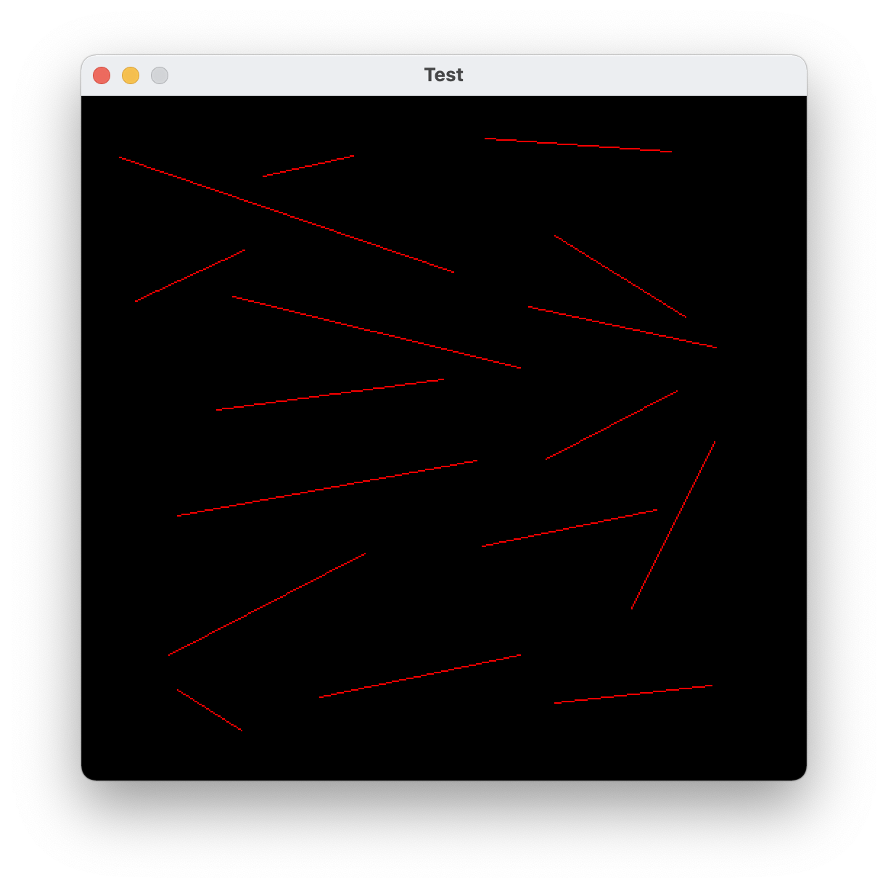
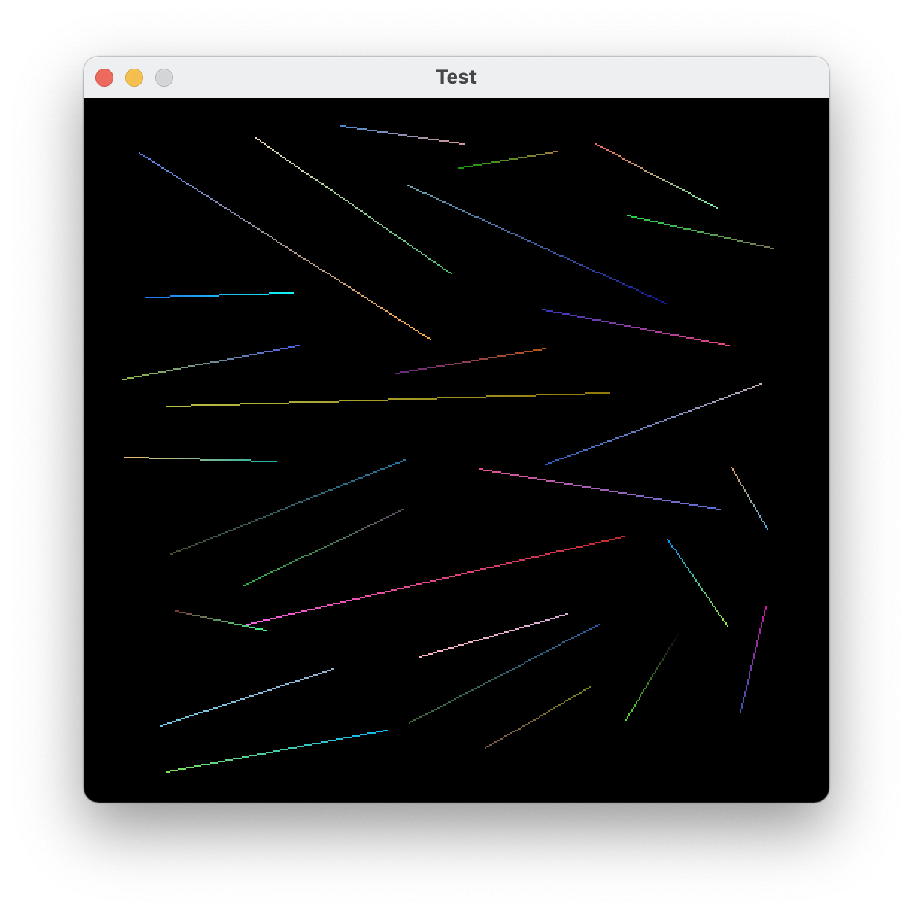
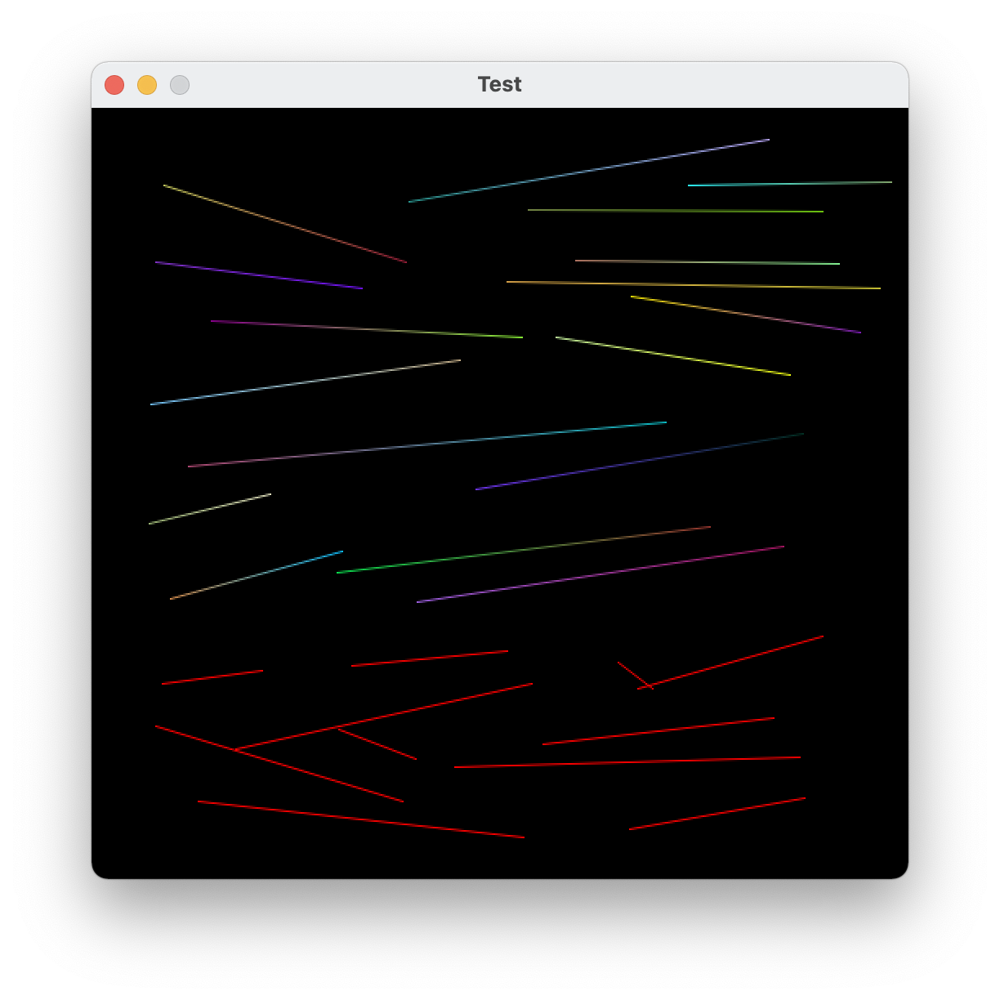
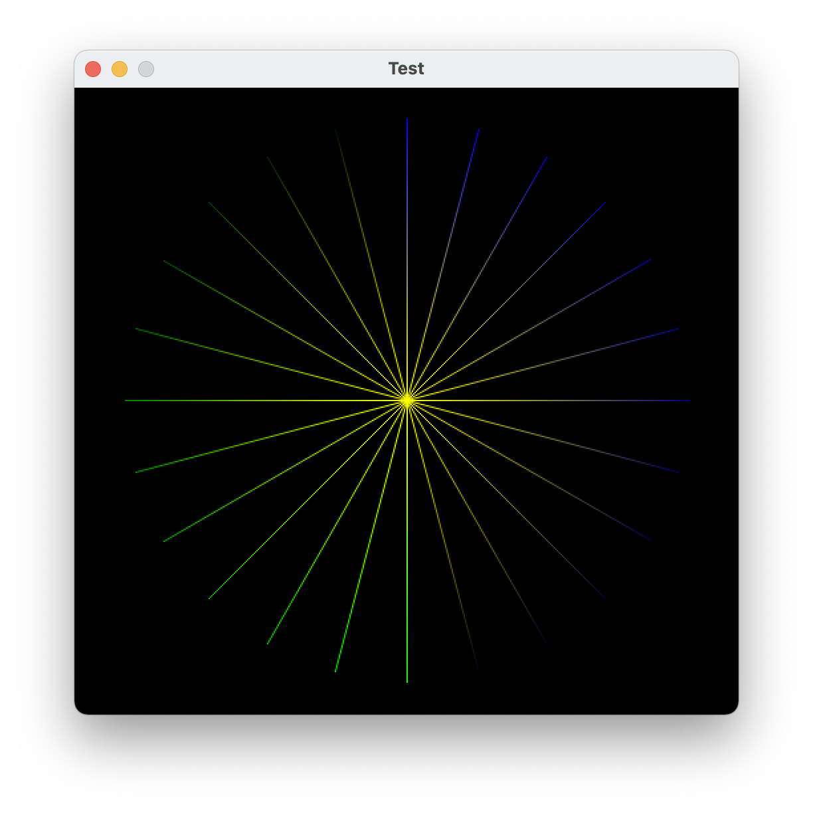
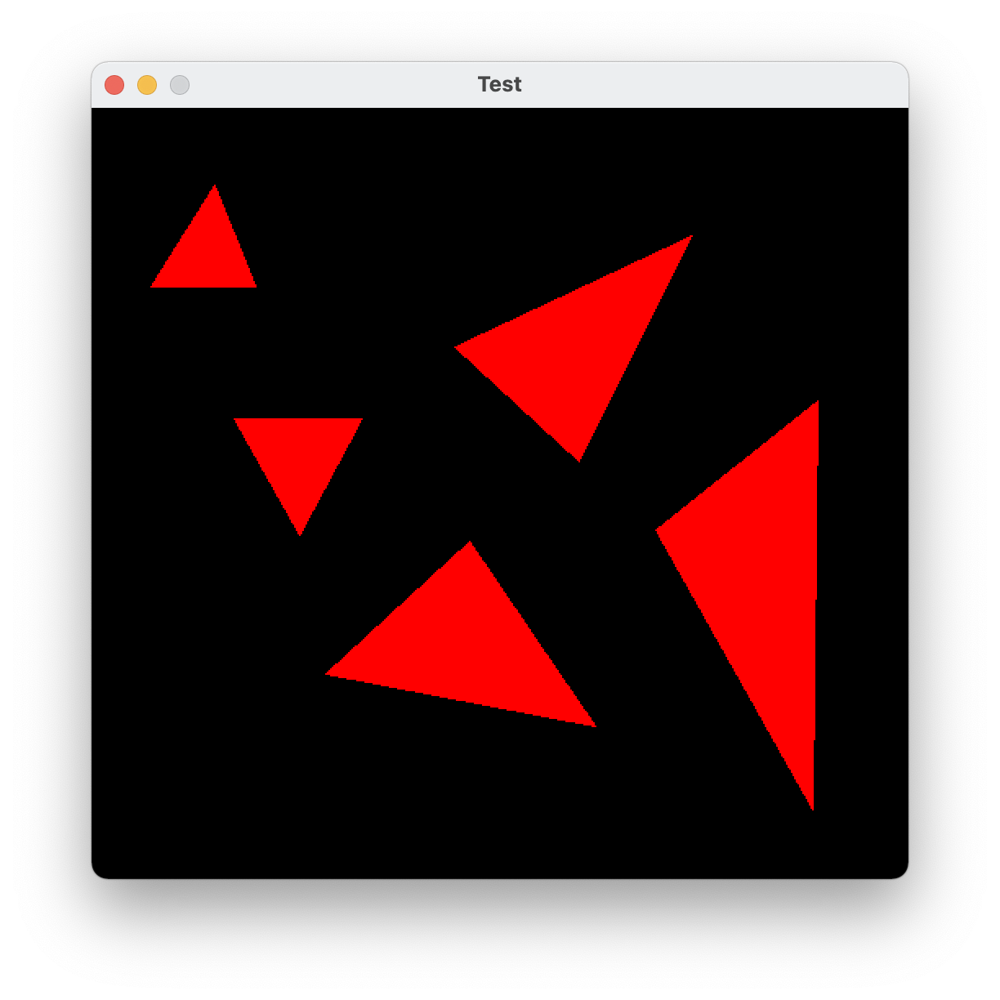
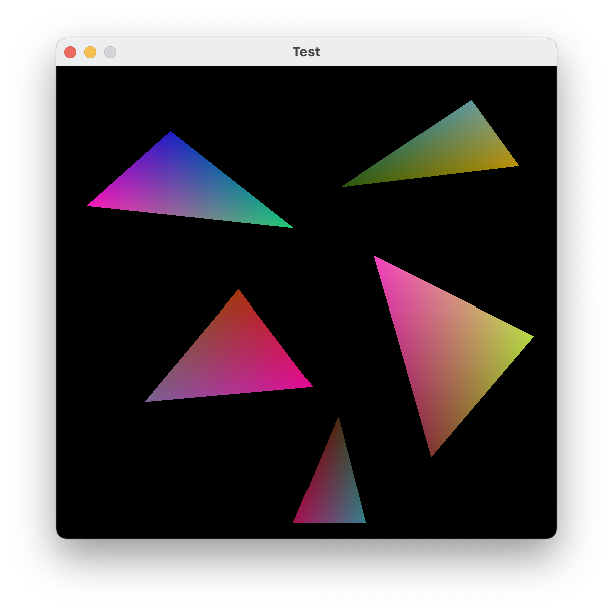
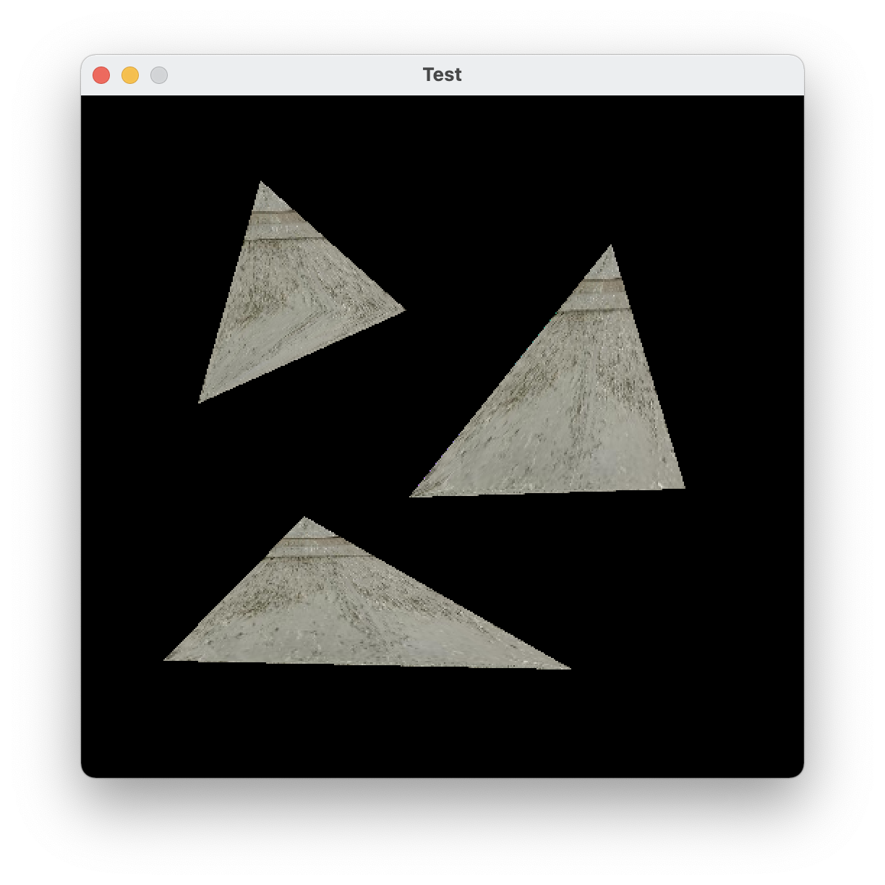
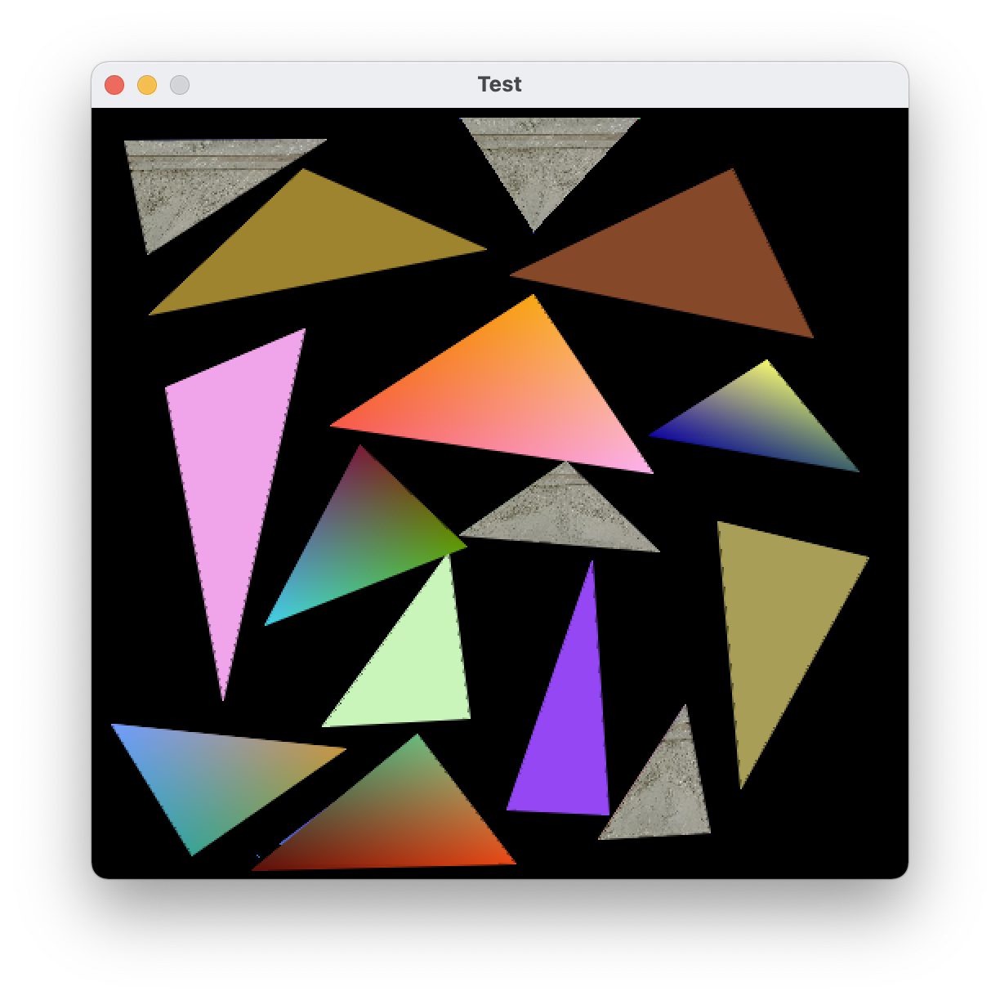

# Scan Conversion README

Student Name: Zhenghang Yin

Student ID: U82871437

## Features

In this project, a number of functions were implemented as required by CS 680.

*   Bresenham's lines without anti-aliasing.

*   Drawing lines with gradient smooth colors.

*   Drawing straight lines with anti-aliasing / drawing gradient anti-aliasing lines.

*   Drawing triangles without anti-aliasing

*   Drawing gradient smooth color triangle without anti-aliasing

*   Drawing triangles using texture mapping without anti-aliasing

*   Anti-aliased drawing triangles / gradient triangles / mapping triangles (experiment)

### Bresenham's lines without anti-aliasing

### Drawing lines with gradient smooth colors

### Drawing straight lines with anti-aliasing / drawing gradient anti-aliasing lines

According to @45 at piazza,&#x20;

In the anti-aliasing algorithm, instead of using Bresenham's algorithm, I directly calculated the position of the sub-pixel through which the line passes. Then the alpha value of the point is plotted according to the distance, based on the distance of the point at the top and bottom two pixels. For example, if a point passes through the position (5, 2.4), then a point with an opacity of (1 - 0.4) = 60% is drawn at (5, 2) and a point with an opacity of 0.4 = 40% is drawn at (5,3) at the same time.

### Drawing triangles without anti-aliasing

### Drawing gradient smooth color triangle without anti-aliasing

### Drawing triangles using texture mapping without anti-aliasing

### Anti-aliased drawing triangles / gradient triangles / mapping triangles (experiment)

### User Interface

The user interface to the program is provided through mouse buttons and keyboard keys. Mouse and keyboard bindings have implemented for you. For toggles status, you can check control flags in Sketch class.

*   **Left Mouse Button**: Places vertices for a line. For every two clicks, a line is drawn.

*   **Right Mouse Button**: Places vertices for a triangle. For every three clicks, a triangle is drawn.

*   **s** / **S**: Toggles smooth interpolation of color on/off for mouse drawn line/triangle. Status saved in doSmooth.

*   **a** / **A**: Toggles anti-aliasing for mouse drawn line/triangle. Status saved in doAA.

*   **m** / **M**: Toggles texture-mapping for mouse drawn line/triangle. Status saved in doTexture.

*   **r** / **R**: Toggle random color assignment to new mouse drawn points. Status saved in random\_color

*   **c** / **C**: Clear the current screen.

*   **t** / **T** / **DOWN** / **RIGHT**: Run the next test case.

*   **UP** / **LEFT**: Run the last test case.

*   **,** / **<**: Decrease the number of steps for the line and triangle test cases.

*   **.** / **>**: Increase the number of steps for the line and triangle test cases.
